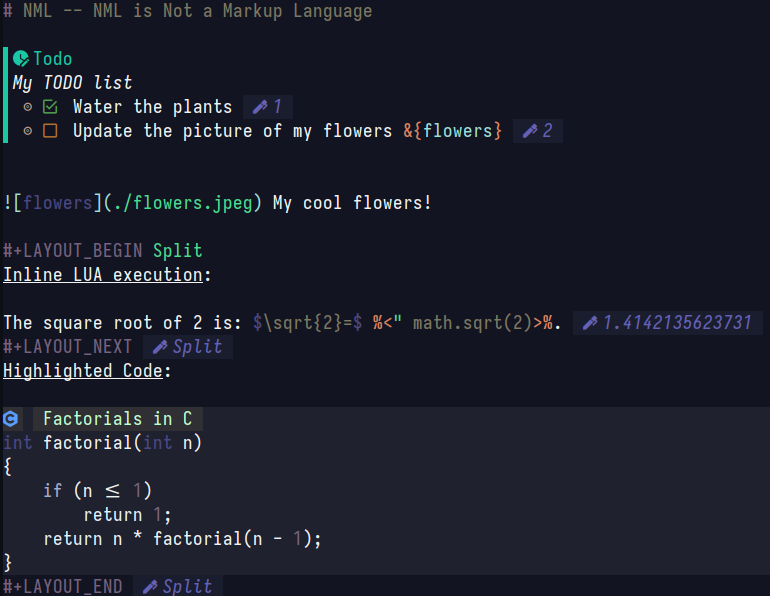

# NML -- Not a markup language!



NML is a language server that comes with a tool for rendering to HTML. The goal of NML is to be a org mode replacement compatible with any editor supporting the language server protocol.

Documentation is available [here](https://ef3d0c3e.github.io/nml/readme/Getting%20Started.html)

## Integration
 * **NeoVim** Check my plugin for neovim integration of the language servers extensions: [nml-nvim](https://github.com/ef3d0c3e/nml-nvim/).

# Requirements

Some features requires external dependencies to work.

## LaTeX rendering for HTML

We ship a modified version of `latex2svg` by Matthias C. Hormann.
The modified program can be found in [third/latex2svg](third/latex2svg) and is licensed under MIT.

The installation instructions can be found on [latex2svg's repository](https://github.com/Moonbase59/latex2svg).

## Graphviz rendering

To render Graphviz graph (i.e `[graph]...[/graph]`),
you need to install the `dot` program from [Graphviz](https://graphviz.org/).

## Lua kernels

NML statically compiles liblua5.4 to use the lua features.

# Compiling

```
cargo build --release --bin nml
```

# Features roadmap

 - [x] Paragraphs
 - [x] LaTeX rendering
 - [x] Graphviz rendering
 - [x] Media
 - [x] References
 - [x] Navigation
 - [x] Cross-Document references
 - [x] LSP
 - [ ] Complete Lua api
 - [ ] Documentation
 - [x] Table
 - [ ] LaTeX output

# License

NML is licensed under the GNU AGPL version 3 or later. See [LICENSE.md](LICENSE.md) for more information.
License for third-party dependencies can be accessed via `cargo license`
